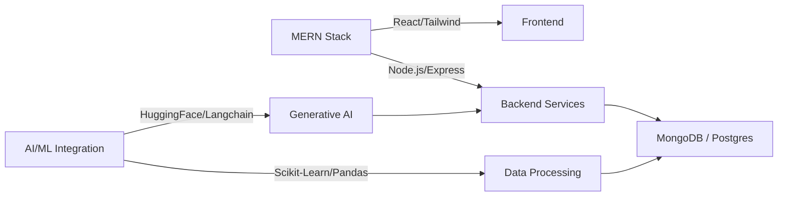

<!-- # Hi there, I'm Anshika Bansal! 👋

I am a 3rd-year IT undergrad at BPIT(GGSIPU), with a strong technical background in data structures, algorithms, software engineering (MERN Stack) and competitive programming. Here is my resume-style GitHub readme:

---

### 🏆 Achievements

| Platform | Rank/Rating | Global Standing |
| :--- | :--- | :--- |
| **CodeChef** | **2 Star** (Peak: 1500) | Best Contest Rank: 499 |
| **LeetCode** |  **Knight** (Peak: 1858) | Top 5.64% Globally | 
| **Codeforces** | **Newbie** (Peak: 1173) | Best Contest Rank: 3626 | -->

<!-- **Key Highlights:**
* 🥇 **CGPA: 9.64** (Top 2% of batch).
* * 🎉 Solved **1100+** DSA problems on Leetcode, Codeforces, GFG etc. -->
  


<!-- ### 🛠️ Skills
* **Core Skills:** Data Structures, Algorithms
* **Programming:** C/C++, Java, Python, JavaScript
* **Web Development:** React, Node.js, Express.js
* **Databases:** MongoDB, SQL
* **UI & Styling:** Tailwind CSS, HTML
* **CS Fundamentals:** OS, OOPS, DBMS, Computer Network

---

### 🚀 Featured Projects

**MindMoose:** [Repo](https://github.com/AnshikaBansal1510/MindMoose) <!-- | [Demo Link](https://mind-moose.vercel.app/) 
* Developed an AI powered Mental Wellness platform with a centralized dashboard featuring community blogs, mood tracking, journaling, and habit-streak management to promote emotional well-being.
* Integrated the **Gemini API** for AI-driven responses and implemented an **AI mental wellness companion** using the **Groq SDK** to enable secure, real-time conversational support.

**Yappify:** [Repo](https://github.com/AnshikaBansal1510/yappify-project) <!-- | [Demo Link](https://yappify-t3ql.onrender.com/) 
* Engineered a MERN-based social learning platform integrating Stream SDK for real-time video
conferencing and chat, while utilizing TanStack Query to optimize state management and data synchronization
for seamless user interactions.

---

### 👨‍💻 Work Experience

**Hash Define** |
*Senior Council* |
*Sep 2024 - Present*
* Organised 5+ technical events for over 100 attendees.
* Mentored **5+ junior students** , helping them improve problem-solving skills through weekly discussions.

**Mentor Minds** |
*October 2024-Present* 
* Initiated and led a peer-learning initiative, mentoring 200+ students in balancing academics with coding through structured guidance and accountability.
* Led a team of 5+ mentors, coordinating mentorship strategies to effectively guide 150+ active mentees. 

--- -->

<!-- ### 🔗 Connect with Me

<p align="center">
  <a href="https://anshika-me.vercel.app/"></a> -->
  <!-- <a href="mailto:anshikabansal1618@gmail.com"></a>
  <a href="https://www.linkedin.com/in/anshikabansal01/" target="_blank"></a>
  <a href="https://github.com/AnshikaBansal1510"></a>
</p> -->

<!-- <div align="center">


<br/>


<a href="https://anshika-me.vercel.app/">

</a>

<a href="https://linkedin.com/in/anshikabansal01">

</a>

<a href="mailto:anshikabansal1618@gmail.com">

</a>

<a href="https://github.com/AnshikaBansal1510">

</a>

<br/>


</div>

---

# About Me

Software Engineer specializing in **Full Stack Development, Artificial Intelligence, Machine Learning, and Product Engineering** with a strong foundation in computer science fundamentals and scalable system design.

Currently pursuing a Bachelor's degree in Information Technology while maintaining exceptional academic performance and consistently solving challenging algorithmic problems across competitive programming platforms.

My engineering philosophy focuses on building products that combine:

- Scalable architecture
- Clean engineering practices
- AI-driven innovation
- High-performance user experiences
- Production-grade reliability
- Security-first development

I enjoy transforming complex ideas into impactful software products that solve real-world problems while maintaining engineering excellence.

### Open To

- Software Engineering Internships
- Full Stack Development Roles
- AI/ML Engineering Opportunities
- Backend Engineering
- Product Engineering
- Open Source Collaborations
- Research Opportunities

---

# Tech Stack

## Languages

<p align="center">

</p>

## Frontend

<p align="center">

</p>

## Backend & Databases

<p align="center">

</p>

## Cloud, DevOps & Tooling

<p align="center">

</p>

---

# AI / ML Expertise

| Domain | Proficiency | Details |
|----------|-------------|----------|
| Generative AI | Advanced | LLM integrations, prompt engineering, AI assistants |
| AI Product Engineering | Advanced | Building production-ready AI applications |
| NLP | Intermediate | Text understanding, conversational systems |
| AI Workflows | Advanced | Multi-step intelligent workflows |
| Prompt Engineering | Advanced | Context optimization and response quality enhancement |
| AI Integration | Advanced | Gemini API, Groq SDK, third-party AI systems |
| ML Fundamentals | Intermediate | Model evaluation, supervised learning concepts |
| AI System Design | Intermediate | Scalable AI-enabled product architecture |

---

# Featured Projects

<details>
<summary><b>MindMoose — AI Powered Mental Wellness Platform</b></summary>

### Overview

AI-driven mental wellness ecosystem designed to promote emotional well-being through intelligent journaling, mood tracking, habit management, and community engagement.

| Category | Details |
|-----------|----------|
| Stack | ReactJS, NodeJS, ExpressJS, MongoDB, Gemini API, Groq SDK |
| Scale | Multi-feature wellness platform |
| Performance | Optimized AI response workflows |
| Security | Authentication, protected APIs, secure user data handling |
| Impact | Personalized emotional support and self-care recommendations |
| Repository | GitHub Repository |

### Engineering Highlights

- Built AI-powered journaling reflection engine.
- Generated personalized wellness strategies using Gemini API.
- Developed context-aware AI companion using Groq SDK.
- Implemented scalable MERN architecture.
- Created habit streak and mood analytics modules.
- Designed community blogging ecosystem.

</details>

<details>
<summary><b>Yappify — Real-Time Language Learning Platform</b></summary>

### Overview

Full-stack language learning ecosystem enabling peer-to-peer collaboration through video conferencing, real-time chat, social networking, and secure authentication.

| Category | Details |
|-----------|----------|
| Stack | ReactJS, NodeJS, ExpressJS, MongoDB, Stream SDK, TanStack Query |
| Scale | Real-time communication platform |
| Performance | Sub-200ms communication latency |
| Security | JWT Authentication & Secure Session Management |
| Impact | Enhanced collaborative language learning experience |
| Repository | GitHub Repository |

### Engineering Highlights

- Integrated Stream SDK for real-time communication.
- Implemented video conferencing and messaging infrastructure.
- Built friend request and social interaction system.
- Optimized client-side state management using TanStack Query.
- Developed secure authentication workflows.
- Designed scalable backend APIs.

</details>

<details>
<summary><b>Competitive Programming Analytics Dashboard</b></summary>

### Overview

Developer-focused analytics platform aggregating coding profile statistics, contest performance, rating progression, and problem-solving insights.

| Category | Details |
|-----------|----------|
| Stack | ReactJS, NodeJS, REST APIs |
| Scale | Multi-platform profile aggregation |
| Performance | Optimized API data processing |
| Security | Secure API integration |
| Impact | Unified competitive programming insights |
| Repository | GitHub Repository |

### Engineering Highlights

- Aggregated data across coding platforms.
- Implemented performance visualization modules.
- Built scalable dashboard architecture.
- Delivered actionable insights through analytics.

</details>

---

# Experience

## Senior Council — Hash Define

**October 2024 – Present**

Contributing to the planning and execution of large-scale technical initiatives, engineering events, and student development programs.

### Scope of Work

- Organized multiple technical events and hackathons.
- Coordinated participant engagement strategies.
- Collaborated with leadership teams for event execution.
- Assisted in community growth initiatives.
- Mentored aspiring developers.

**Skills:** `Leadership` `Event Management` `Team Coordination` `Technical Community Building`

<br/>

## Initiative Lead — Mentor Minds

**November 2024 – Present**

Leading a peer-to-peer mentorship ecosystem focused on academic excellence, career growth, and technical skill development.

### Scope of Work

- Led mentorship initiatives for 200+ students.
- Managed mentor allocation and guidance programs.
- Conducted technical and academic mentoring sessions.
- Developed structured preparation roadmaps.
- Facilitated collaborative learning environments.

**Skills:** `Mentorship` `Leadership` `Community Building` `Program Management`

---

# Achievements

<div align="center">

| Recognition | Details |
|-------------|---------|
| Academic Excellence | Rank 1 in College |
| University Achievement | Rank 2 in GGSIPU |
| LeetCode Knight | Peak Rating 1858 |
| Competitive Programming | 1200+ Problems Solved |
| Codeforces Pupil | Peak Rating 1327 |
| CodeChef 3-Star | Peak Rating 1606 |
| Contest Performance | Global Rank 499 |
| Technical Leadership | Mentored 150+ Students |

</div>

---

# Certifications

## AWS


## Oracle


## NPTEL


## Cisco


---

# Coding Profiles

<div align="center">

<a href="https://leetcode.com/">

</a>

<a href="https://www.geeksforgeeks.org/">

</a>

<a href="https://www.hackerrank.com/">

</a>

<a href="https://www.codechef.com/">

</a>

</div>

---

# GitHub Analytics

<div align="center">


</div>

---

# GitHub Trophies

<div align="center">


</div>

---

# Contribution Activity

<div align="center">


</div>

---

# Contribution Snake

<div align="center">


</div>

---

# Current Focus

```yaml
Learning:
  - Advanced System Design
  - Distributed Systems
  - Production Grade Backend Engineering
  - Applied Machine Learning
  - AI Agent Architectures

Building:
  - AI Powered Products
  - Full Stack Applications
  - Developer Tools
  - Open Source Projects

Exploring:
  - LLM Engineering
  - Retrieval Augmented Generation
  - Agentic Workflows
  - Cloud Infrastructure

Open To:
  - Software Engineering Internships
  - AI/ML Roles
  - Backend Development
  - Open Source Collaboration
  - Product Engineering Opportunities
```

---

# Connect

<div align="center">

<a href="mailto:anshikabansal1618@gmail.com">

</a>

<a href="https://linkedin.com/in/your-linkedin">

</a>

<a href="https://github.com/your-github-username">

</a>

<a href="https://your-portfolio-link.com">

</a>

</div>

---

<div align="center"> -->

<!-- *"Engineering intelligent systems, building scalable products, and creating impact through technology."*

<br/><br/>


</div> -->

<div align="center">
  
  
</div>

<div align="center">


</div>

<div align="center">
  
  
  
</div>

---


### About Me:

*What I Build*  
**What I Build**  
Full-stack web applications and AI-driven platforms. Specializing in the MERN stack and integrating intelligent ML models using Scikit-Learn, LightGBM, and Langchain into user-centric products.

*Technical Expertise*  
- *Frontend Development*: React.js, TailwindCSS, HTML, CSS for creating responsive and dynamic UIs.
- *Backend Development*: Node.js, Express.js architecture, RESTful API design, and JWT Authentication.
- *Competitive Programming*: Strong grasp of Data Structures and Algorithms with over 1200+ problems solved across major platforms.
**Technical Expertise**  
- **Frontend Development**: React.js, TailwindCSS, HTML, CSS for creating responsive and dynamic UIs.
- **Backend Development**: Node.js, Express.js architecture, RESTful API design, and JWT Authentication.
- **AI/ML & Data**: Predictive modeling, feature engineering using Python, Pandas, NumPy, Scikit-learn, and HuggingFace APIs.
- **Competitive Programming**: Strong grasp of Data Structures and Algorithms with over 1200+ problems solved across major platforms.

*Open to Collaborate On*  
**Open to Collaborate On**  
Innovative web applications, AI/ML integrations, Hackathons, open-source development, and projects emphasizing scalability and performance.

*Currently Advancing In*  
**Currently Advancing In**  
Generative AI implementations, LangChain, and advanced backend optimization techniques.

*Technical Discussions*  
**Technical Discussions**  
Data Structures & Algorithms, Object-Oriented Programming, Database Management Systems, Agentic workflows, and Web Development best practices.

*Engineering Philosophy*  
**Engineering Philosophy**  
Analyze data deeply, optimize creatively, design responsively, and never stop competing and learning in the coding community.

*Reach Me*: anshikabansal1618@gmail.com
**Reach Me**: anshikabansal1618@gmail.com

<br clear="both">

---

## Connect With Me:

<div align="center">

[](https://www.linkedin.com/in/anshikabansal01/)
[](https://github.com/AnshikaBansal1510)
[](https://leetcode.com/u/AnshikaBansal1510/)
[](https://codeforces.com/profile/anshika_bansal2430)
[](https://www.codechef.com/users/anshika_2430)

</div>


## Tech Stack:

<div align="center">

### Languages

 


### Frontend Development


### Backend & APIs


### Databases


### DevOps & Tools


</div>

---

## Engineering Expertise & Technical Focus

<div align="center">

### Development Architecture

mermaid


</div>

### Technical Problem Solving

<div align="center">

| *Data Structures* | *Algorithms* | *GenAI* | *Backend* |
| **Data Structures** | **Algorithms** | **GenAI** | **Backend** |
|:---:|:---:|:---:|:---:|
| Trees, Graphs, Heaps | Dynamic Programming | Feature Engineering | RESTful APIs |
| Hash Tables, Tries | Graph Algorithms | Model Evaluation | Token Authentication |
| Linked Lists, Stacks | Sorting & Searching | Database Design |

</div>

---

## Contribution Graph

<div align="center">

[](https://github.com/AnshikaBansal1510)

</div>

---

<div align="center">

### "Strive for progress, not perfection."

[](https://visitcount.itsvg.in)

</div>


